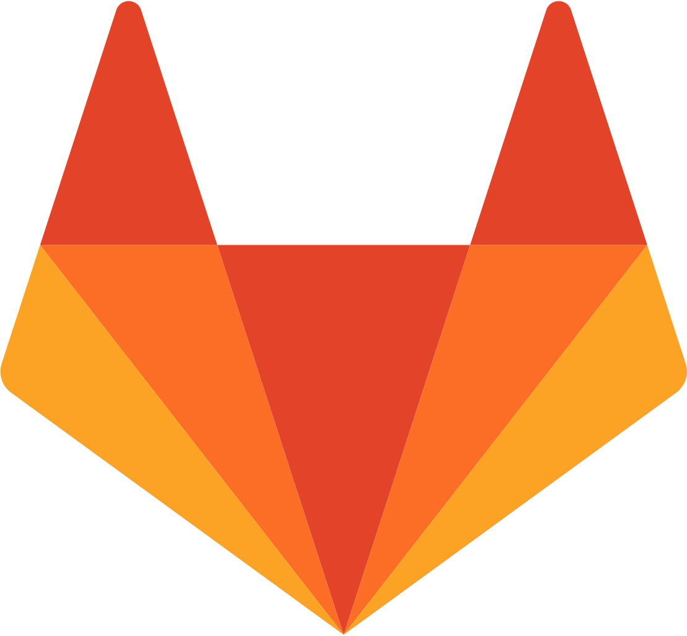
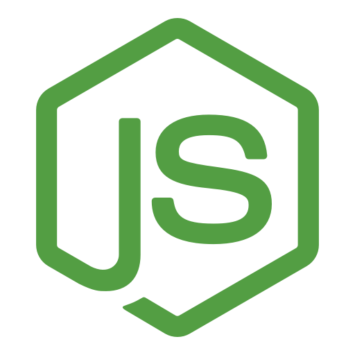

# Hi there, I am Benjie 👋
- 📓 Biomedical engineering student at the University of British Columbia
- 🚀 Molecular Simulations Co-Op at [Zymeworks Inc](https://www.zymeworks.com/)

## Connect with me

 
 

## Languages and Tools

 
<!--
**benjiemc/benjiemc** is a ✨ _special_ ✨ repository because its `README.md` (this file) appears on your GitHub profile.

Here are some ideas to get you started:

- 🔭 I’m currently working on ...
- 🌱 I’m currently learning ...
- 👯 I’m looking to collaborate on ...
- 🤔 I’m looking for help with ...
- 💬 Ask me about ...
- 📫 How to reach me: ...
- 😄 Pronouns: ...
- ⚡ Fun fact: ...
-->
